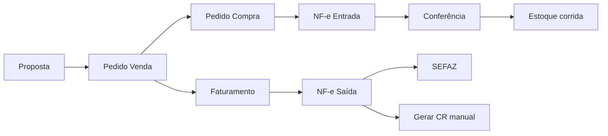

# Brief completo — Nexus ERP

**Documento:** visão consolidada do sistema  
**Versão de referência:** ERP 4.0.16.2  
**Última atualização:** 24/06/2026  
**Repositório:** `nexus-valve-hub`  
**Público-alvo:** gestão, produto, analistas, desenvolvedores e operação

---

## Sumário

1. [Resumo executivo](#1-resumo-executivo)
2. [Contexto e objetivo do produto](#2-contexto-e-objetivo-do-produto)
3. [Princípios de arquitetura e produto](#3-princípios-de-arquitetura-e-produto)
4. [Stack e infraestrutura](#4-stack-e-infraestrutura)
5. [Modelo operacional Nexus](#5-modelo-operacional-nexus)
6. [Mapa de módulos e status](#6-mapa-de-módulos-e-status)
7. [Cadastros e produtos](#7-cadastros-e-produtos)
8. [Comercial e compras](#8-comercial-e-compras)
9. [Fiscal — entrada, saída e DF-e](#9-fiscal--entrada-saída-e-df-e)
10. [Estoque, expedição e rastreabilidade](#10-estoque-expedição-e-rastreabilidade)
11. [Qualidade industrial](#11-qualidade-industrial)
12. [Financeiro](#12-financeiro)
13. [Contábil, BI e relatórios](#13-contábil-bi-e-relatórios)
14. [Autenticação, permissões e contexto](#14-autenticação-permissões-e-contexto)
15. [Fluxos de negócio ponta a ponta](#15-fluxos-de-negócio-ponta-a-ponta)
16. [Integrações externas](#16-integrações-externas)
17. [Interface, design system e padrões de UX](#17-interface-design-system-e-padrões-de-ux)
18. [API e contratos](#18-api-e-contratos)
19. [Limitações conhecidas e decisões explícitas](#19-limitações-conhecidas-e-decisões-explícitas)
20. [Roadmap e próximas fases](#20-roadmap-e-próximas-fases)
21. [Documentação complementar](#21-documentação-complementar)
22. [Glossário](#22-glossário)

---

## 1. Resumo executivo

O **Nexus ERP** é um sistema de gestão empresarial desenvolvido para a operação da **Nexus Válvulas e Conexões Industriais**, cobrindo o ciclo industrial-comercial desde o **cadastro técnico de produtos** (válvulas, tubos, conexões, materiais dimensionais) até **comercial, fiscal (NF-e/CT-e), estoque por corrida, qualidade (certificados) e financeiro**.

O sistema está em **evolução incremental** por fases numeradas (ERP 4.0.x), com homologação fiscal e operacional antes de ligar comportamentos globais em produção.

| Dimensão | Situação atual |
|----------|----------------|
| **Maturidade geral** | Operacional em produção local com módulos avançados em fiscal saída, entrada, financeiro base e qualidade |
| **Diferencial industrial** | Rastreabilidade por corrida/lote, certificados de fornecedor (CF) e de qualidade (CQ) |
| **Diferencial fiscal** | Separação entrada × saída; cenário fiscal de saída com homologação por proposta; emissão NF-e homologação e produção |
| **Modelo operacional** | Venda sob demanda — estoque **não bloqueia** emissão de NF-e saída |
| **Financeiro** | CR/CP manual; geração explícita a partir de NF-e (sem automação na autorização) |
| **Pendências estratégicas** | CRM, remessas, contábil, kardex completo, deep links entre telas |

---

## 2. Contexto e objetivo do produto

### 2.1 Problema que o ERP resolve

A operação Nexus combina:

- **Produtos técnicos** com codificação dimensional (polegada, schedule, rosca, norma, material).
- **Compra e venda flexíveis** — entrada antes ou depois da saída fiscal.
- **Exigência de rastreabilidade** — corrida de material, certificados de fornecedor na entrada e certificados de qualidade na saída.
- **Complexidade fiscal brasileira** — ICMS, ST, DIFAL, FCP, reforma tributária (IBS/CBS preparatório), NF-e própria e XML de terceiros.

O ERP unifica esses domínios em uma única base, evitando planilhas paralelas e inconsistência entre comercial, estoque, fiscal e financeiro.

### 2.2 Escopo funcional (macrofrentes)

| # | Macrofrente | Papel |
|---|-------------|-------|
| 1 | Cadastros mestres | Empresa, clientes, fornecedores, transportadoras, colaboradores, produtos |
| 2 | CRM | Leads, pipeline (não iniciado) |
| 3 | Propostas | Simulação, precificação, homologação fiscal |
| 4 | Pedido de venda | Compromisso comercial, faturamento, NF-e |
| 5 | Fiscal | NF-e/CT-e entrada e saída, DF-e, manifestação, apuração |
| 6 | Estoque / expedição | Saldo por corrida, atendimento operacional, expedição |
| 7 | Qualidade | CF, CQ, corridas |
| 8 | Financeiro | CR, CP, créditos, relatórios |
| 9 | Contábil | Plano de contas (futuro) |
| 10 | BI / auditoria | Dashboards por módulo, relatórios PDF |

### 2.3 Separação fiscal (decisão estrutural)

| Fluxo | Responsabilidade |
|-------|------------------|
| **Entrada** | Classificar e **validar** XML recebido do fornecedor. Regras de entrada, CFOP origem × CFOP entrada, bloqueios, elegibilidade de estoque, conferência. |
| **Saída** | **Cenário fiscal** para proposta, homologação e emissão própria. Motor com fallback na regra legada até migração completa. |

Essa separação evita misturar “o que entrou” com “o que vamos emitir”.

---

## 3. Princípios de arquitetura e produto

| Princípio | Descrição |
|-----------|-----------|
| **Evolução incremental** | Fases numeradas com checklist no roadmap; cada entrega documentada |
| **Homologação antes de produção** | NF-e saída: homologação SEFAZ (tpAmb=2) validada antes da produção; emissão **produção ativa** no ambiente operacional (`NFE_PRODUCAO_HABILITADA` conforme `.env` do servidor) |
| **Estoque não bloqueia NF-e** | Venda sob demanda; atendimento flexível (fluxos A, B e C) |
| **Financeiro manual na origem fiscal** | CR/CP a partir de NF-e exige ação explícita do usuário |
| **Somente leitura onde aplicável** | Painéis consolidados (BI, centro de informações do produto, rastreabilidade) não alteram regras de negócio |
| **Documentos operacionais × base importada** | XML histórico para consulta; homologação excluída de apuração real |
| **Backend como fonte da verdade** | Regras de negócio em services Django; frontend consome API REST |
| **Rastreabilidade industrial** | Corrida/lote como eixo de estoque e qualidade |

---

## 4. Stack e infraestrutura

### 4.1 Arquitetura em camadas

```text
┌─────────────────────────────────────────────────────────────┐
│  Frontend SPA — React 18 + Vite 5 + TypeScript              │
│  Porta host: 5174 (Docker) — proxy /api → backend           │
└──────────────────────────┬──────────────────────────────────┘
                           │ JSON + JWT Bearer
┌──────────────────────────▼──────────────────────────────────┐
│  Backend — Django 5.2 + Django REST Framework               │
│  Porta: 8000 — prefixo /api/                                │
│  Apps: cadastros, produtos, comercial, fiscal, qualidade,   │
│        financeiro, regras_fiscais, expedicao, core…         │
└──────────────────────────┬──────────────────────────────────┘
                           │
┌──────────────────────────▼──────────────────────────────────┐
│  PostgreSQL 15                                              │
└──────────────────────────┬──────────────────────────────────┘
                           │
┌──────────────────────────▼──────────────────────────────────┐
│  SEFAZ (PyNFe), ViaCEP, consulta CNPJ/IE, SMTP              │
└─────────────────────────────────────────────────────────────┘
```

### 4.2 Execução local

```bash
docker compose up -d
docker compose restart backend    # após alterar rotas/views
docker compose exec backend python manage.py check
docker compose exec frontend npm run build
```

### 4.3 Convenções

- Idioma UI: **pt-BR**
- Fuso: `America/Sao_Paulo`
- Moeda: BRL
- Datas exibidas: `dd/mm/aaaa`

---

## 5. Modelo operacional Nexus

Documento detalhado: [`modelo-operacional-nexus.md`](modelo-operacional-nexus.md).

### 5.1 Premissa

A Nexus opera majoritariamente com **venda sob demanda**. O ERP controla **origem e intenção de atendimento** do item, não apenas saldo físico.

### 5.2 Fluxos principais

| Fluxo | Sequência resumida |
|-------|-------------------|
| **A — Entrada antes da saída** | PV → PC → NF entrada → conferência → estoque → faturamento → NF saída |
| **B — Saída antes da entrada** | PV → faturamento → NF saída autorizada → retirada fornecedor → NF entrada posterior |
| **C — Misto** | Parte conciliada + parte pendente por item/quantidade |

**Regra central:** NF-e saída **não é bloqueada** automaticamente por ausência de NF-e entrada.

### 5.3 Entidades operacionais-chave

| Modelo | Papel |
|--------|-------|
| `AlocacaoAtendimento` | Intenção de atendimento por item (tipo, origem/destino físico, vínculos PC/NF/CT-e) |
| `AtendimentoEstoque` | Compromisso na NF saída (modo IMEDIATO ou ANTECIPADO) |
| `EstoqueCorrida` | Saldo físico por produto × corrida |
| `FaturamentoPedidoVenda` | Solicitação de faturamento parcial/total → NF-e saída |
| `Corrida` | Identificador técnico de lote/material (rastreabilidade) |

### 5.4 Tipos de atendimento (`tipo_atendimento`)

| Valor | Descrição |
|-------|-----------|
| `ESTOQUE_PROPRIO` | Atendido do estoque próprio |
| `ENTRADA_CONCILIADA` | Entrada fiscal já conciliada |
| `RETIRADA_FORNECEDOR` | Retirada no fornecedor após saída |
| `ENTREGA_DIRETA_FORNECEDOR_CLIENTE` | Fornecedor entrega direto ao cliente |
| `RETIRADA_FORNECEDOR_TRANSPORTADORA` | Fornecedor → transportadora |
| `COMPRA_VINCULADA` | Compra vinculada, destino a definir |
| `MISTO` | Cenário misto por item |
| `NAO_DEFINIDO` | Padrão seguro |

---

## 6. Mapa de módulos e status

| Módulo | Status | Prioridade | Entregue | Falta (resumo) |
|--------|--------|------------|----------|----------------|
| Cadastros mestres | Parcial | Média | Clientes, fornecedores, empresas, produtos, famílias, centro de informações + rastreabilidade | Contatos múltiplos, IE/regime refinados |
| CRM | Não iniciado | Baixa | — | Leads, pipeline |
| Propostas | Em evolução | Alta | CRUD, fiscal, homologação, conversão PV | Versionamento, PDF avançado |
| Pedido de venda | Parcial | Alta | PV, faturamento parcial, NF rascunho | Reserva refinada, deep links |
| Fiscal entrada | Em evolução | Alta | Classificação, conferência, estoque, fornecedor CP | Snapshot fiscal persistido |
| NF-e saída | Parcial | Alta | Conferência, homologação, produção, DIFAL, DANFE/XML, CC-e, cancelamento e inutilização SEFAZ | Consumo total do cenário fiscal |
| Estoque | Em evolução | Alta | Saldo corrida, atendimento, painel produto | Kardex, estorno, relatório ponta a ponta |
| Qualidade | Parcial | Média | CF, CQ, numeração automática, CQ manual | Dashboard pendências |
| Financeiro | Base operacional | Alta | CR/CP, baixas, créditos, relatórios PDF | Conciliação, automação pós-autorização |
| Contábil | Futuro | Baixa | Placeholder | Plano de contas, lançamentos |
| BI | Parcial | Média | Dashboards por módulo (incl. Expedição), menu reorganizado, Contador export XML | SPED, menu por permissão, auditoria |
| Remessas | Não iniciado | Média | CFOPs auxiliares | Modelo e emissão |

---

## 7. Cadastros e produtos

### 7.1 Cadastros mestres

**Telas:** `/empresas`, `/clientes`, `/fornecedores`, `/transportadoras`, `/colaboradores`, `/minha-conta`

| Recurso | Detalhe |
|---------|---------|
| Consultas externas | CEP (ViaCEP), CNPJ, IE por UF |
| Colaborador | Funções internas + vínculo usuário Django + gestão de acesso |
| Empresa | Certificado A1 para NF-e/SEFAZ, ambiente homologação/produção |

### 7.2 Produtos

**Tela:** `/produtos` — modal com abas:

| Aba | Conteúdo |
|-----|----------|
| Dados gerais | Código, descrição, unidade, preços, estoque mínimo |
| Classificação industrial | Material, norma, família, dimensional (polegada, rosca, schedule), conversões |
| Composição / montagem | BOM, equivalência fornecedor |
| Fiscal | NCM efetivo, unidade fiscal |
| Painel operacional | Centro de informações (somente leitura) |
| Rastreabilidade | Corridas, CQ, CF, NF entrada/saída por corrida (ERP 4.0.15.2.41) |

**Codificação:** famílias com regras de código (legado, polegada, manual fabricante); preview de código e descrição.

**APIs de painel:**

| Endpoint | Função |
|----------|--------|
| `GET /api/produtos/{id}/painel/resumo/` | Estoque, histórico compra/venda, inteligência de preços, qualidade, fiscal |
| `GET /api/produtos/{id}/painel/rastreabilidade/` | Corridas, CQs, CFs, NF entrada/saída vinculadas |

### 7.3 Corridas

**Tela:** `/corridas` — cadastro técnico de corrida (número, produto, fornecedor, ensaios JSON, NF entrada texto).

---

## 8. Comercial e compras

### 8.1 Propostas

**Tela:** `/propostas`

| Etapa | Descrição |
|-------|-----------|
| Cadastro | Itens com produto ou avulso + NCM |
| Precificação | Margem, custo, rentabilidade interna |
| Fiscal | Opt-in `usar_cenario_fiscal_saida`; comparativo legado × cenário |
| Homologação | Iniciar, aprovar, reprovar assistido por proposta |
| Conversão | Gerar pedido de venda |

**Numeração:** `PROP-AAAAMMDD-NNNN`  
**PDF:** `GET /api/propostas/{id}/pdf/` (versão externa)

### 8.2 Pedido de venda

**Tela:** `/pedidos-venda` — modal em abas (Resumo, Itens, Faturamento, NF-e/Fiscal, Observações)

| Capacidade | Detalhe |
|------------|---------|
| Origem | Manual ou conversão de proposta |
| Faturamento | Parcial com `FAT-YYYYMMDD-NNNN` |
| NF-e | Rascunho a partir de faturamento `PRONTO_PARA_NFE` |
| Atendimento | Alocações operacionais por item |
| PDF | `GET /api/pedidos-venda/{id}/pdf/` |

**Numeração:** `PV-AAAAMMDD-NNNN`

### 8.3 Pedido de compra

**Tela:** `/pedidos-compra`

| Capacidade | Detalhe |
|------------|---------|
| Itens | `quantidade_recebida` para acompanhamento |
| Vínculo | NF-e entrada e conferência |
| PDF | `GET /api/pedidos-compra/{id}/pdf/` |

**Numeração:** `PC-AAAAMMDD-NNNN`

---

## 9. Fiscal — entrada, saída e DF-e

### 9.1 NF-e entrada

**Telas:**

| Rota | Função |
|------|--------|
| `/nfe-entrada` | Operacional — importar XML, entrada própria |
| `/nfe-entrada-historica-importada` | Base importada |
| `/nfe-entrada/:id/conferencia` | Conferência item a item |

**Fluxo conferência:**

1. Importar XML (fornecedor ou entrada própria já emitida)
2. Vincular itens a produtos (equivalência sugerida)
3. Resolver pendências (produto, pedido compra, divergências)
4. Finalizar → aplica estoque físico por corrida (quando elegível)
5. Identificar fornecedor → liberar wizard de CP
6. Gerar contas a pagar **manualmente** (wizard financeiro)

**Separação explícita:** pendências operacionais **não bloqueiam** geração de CP; bloqueios reais são fornecedor, valor, cancelamento, duplicidade.

### 9.2 NF-e saída

**Tela:** `/nfe-saida` — listagem + conferência em modal + drawer de detalhes

**Ciclo de vida:**

```text
RASCUNHO → conferência (abas) → prontidão → XML prévia/oficial
  → homologação SEFAZ (tpAmb=2) → produção SEFAZ (se habilitada)
```

| Recurso | Detalhe |
|---------|---------|
| Validação | Checklist pré-emissão, validação por grupo (cliente, itens, fiscal, estoque…) |
| Preview | XML nfelib 4.00 + DANFE BrazilFiscalReport |
| Impostos | Atualizar do rascunho conforme regra fiscal atual |
| Reforma tributária | IBS/CBS no snapshot e XML (preparatório) |
| DIFAL | Venda interestadual a não contribuinte |
| Numeração | Pool com reutilização de número não transmitido |
| Pós-autorização | DANFE/XML autorizado, consulta SEFAZ, envio e-mail DANFE/XML |
| Eventos SEFAZ | Carta de correção (CC-e) e cancelamento — homologação e produção |
| Modos estoque | IMEDIATO (baixa na emissão) / ANTECIPADO (compromisso sem baixa) |

**Pendência fiscal:** contingência SEFAZ e consumo pleno do cenário na emissão.

### 9.3 Regras e cenários fiscais

**Tela:** `/regras-fiscais`

| Componente | Descrição |
|------------|-----------|
| Cenário saída | `CenarioFiscalSaida` + escopos (Geral, NCM, prefixo NCM, Produto) |
| Regra saída | `RegraFiscalSaida` com prioridade, UFs, CSTs, alíquotas |
| Cenário entrada | `CenarioFiscalEntrada` + CFOP origem × CFOP entrada |
| Motor | Fallback `RegraFiscal` legada; homologação em lote por proposta |
| Checklist produção | `GET /api/regras-fiscais/checklist-producao/` |

### 9.4 DF-e, CT-e e manifestação

| Tela | Função |
|------|--------|
| `/central-dfe` | Armazenamento e consulta XML |
| `/manifestacao-destinatario` | Ciência, confirmação, desconhecimento, operação não realizada |
| `/cte-entrada` | CT-e operacional + identificação fornecedor |
| `/cte-historico-importado` | Base CT-e importada |
| `/nfe-historica-importada` | Base NF-e saída importada |
| `/visao-gerencial-nfe-historica` | Painel fiscal gerencial |
| `/apuracao-fiscal` | Apuração entrada/saída |
| `/nfe-sefaz` | Status serviço SEFAZ |

---

## 10. Estoque, expedição e rastreabilidade

### 10.1 Estoque

**Telas:** `/estoque`, `/atendimentos-estoque`

| Conceito | Cálculo / modelo |
|----------|------------------|
| Saldo físico | Soma `EstoqueCorrida.saldo` por produto |
| Reservado | Quantidade pendente em atendimentos PENDENTE/PARCIAL |
| Disponível | Físico − reservado |
| Aplicação | Conferência NF entrada finalizada → corrida |

### 10.2 Expedição

**Tela:** `/expedicao` — fase 1A (logística operacional básica).  
Documento: [`expedicao-logistica-fase1a.md`](expedicao-logistica-fase1a.md).

### 10.3 Rastreabilidade na ficha do produto

Consolidação **somente leitura** (ERP 4.0.15.2.41):

- Corridas com saldo, origem técnica (NF-e ou cadastro manual), flag CF
- Certificados de qualidade agrupados com corridas dos itens
- Certificados de fornecedor com referência de NF entrada
- NF-e entrada e saída vinculadas à corrida

Brief da fase: [`brief-erp-40241-rastreabilidade-produto.md`](brief-erp-40241-rastreabilidade-produto.md).

---

## 11. Qualidade industrial

**Telas:** `/certificados`, `/certificados-fornecedor`, `/corridas`

| Documento | Sigla | Momento | Descrição |
|-----------|-------|---------|-----------|
| Certificado de Fornecedor | **CF** | Entrada | Vinculado à conferência NF-e; dados técnicos por item/corrida |
| Certificado de Qualidade | **CQ** | Saída | Emitido ao cliente; itens com corrida/lote; PDF |
| Corrida | — | Estoque | Identificador técnico; composição química, tração, impacto (JSON) |

| Regra | Detalhe |
|-------|---------|
| Emissão definitiva CQ | Exige rastreabilidade (corrida) |
| CQ manual | Permitido sem CF em cenários específicos (ERP 4.0.15.2.6) |
| Numeração CQ | Automática via `SequenciaCertificadoQualidade` |

Documento: [`qualidade-certificados.md`](qualidade-certificados.md).

---

## 12. Financeiro

**Hub:** `/financeiro`

| Tela | Função |
|------|--------|
| `/financeiro/contas-receber` | Títulos a receber |
| `/financeiro/contas-pagar` | Títulos a pagar |
| `/financeiro/creditos` | Créditos cliente/fornecedor |
| `/financeiro/cadastros` | Contas, categorias, centros de custo |
| `/financeiro/relatorios/*` | 6 relatórios JSON + exportação PDF |

### 12.1 Origens de título

| Origem | Geração |
|--------|---------|
| Manual | CR, CP, despesa, tributo |
| NF-e saída autorizada | Wizard `gerar-contas-receber` (manual) |
| NF-e entrada conferida | Wizard `gerar-contas-pagar` (manual) |
| Crédito | Pagamento a maior, devolução |

**Numeração:** `CR-AAAA-NNNNNN` / `CP-AAAA-NNNNNN`

### 12.2 Visão geral e alertas

`GET /api/financeiro/resumo/` — cards, vencimentos, alertas, créditos disponíveis, resumo por conta/categoria.

### 12.3 Relatórios PDF

Motor central em `apps.relatorios` (ReportLab, isolado do fiscal).  
Relatórios: contas a receber, contas a pagar, fluxo previsto, categorias, clientes, fornecedores.

---

## 13. Contábil, BI e relatórios

### 13.1 Contábil

**Tela:** `/contabil` — placeholder.  
Modelos básicos: `PlanoConta`, `Lancamento` — integração futura.

### 13.2 Dashboards BI

**Telas:** `/dashboard` + módulos (`comercial`, `compras`, `estoque`, `expedicao`, `fiscal`, `qualidade`, `financeiro`)

- KPIs e gráficos (Recharts); hero KPI dinâmico por módulo
- Permissões por módulo (`dashboard_permissions.py`)
- Drill-down com filtros de período e empresa
- Financeiro com resumo operacional real (`montar_resumo_financeiro`) — não é mais stub

### 13.3 Navegação (menu lateral)

Configuração central: `frontend/src/config/sidebarMenuConfig.ts`

| Seção | Conteúdo principal |
|-------|-------------------|
| Dashboard | Visão geral + painéis BI por permissão |
| Cadastros | Empresas, clientes, fornecedores, transportadoras, colaboradores |
| Catálogo | Produtos, corridas/lotes |
| Compras | Pedidos, NF-e entrada, base NF-e entrada |
| Comercial | Propostas, pedidos de venda |
| CRM | Placeholder (`/modulos/crm`) |
| Estoque & Logística | Saldos, atendimentos operacionais, expedição |
| Fiscal | Subgrupos Operação / Bases·Histórico / Gestão |
| Qualidade | CQ, certificados fornecedor |
| Financeiro | CR, CP, créditos, relatórios, cadastros financeiros |
| Gestão de Resultado / Folha·RH | Placeholders |
| Contábil | `/contabil` |
| Contador | Exportar XMLs (`/contador/exportar-xmls`); SPED em breve |

Seções colapsadas por padrão; apenas a seção da rota ativa expandida.

### 13.4 Módulo Contador

| Endpoint / tela | Função |
|-----------------|--------|
| `GET /api/contador/exportar-xmls/?inicio=&fim=&tipo=` | ZIP com XMLs (NF-e saída/entrada, CT-e base) |
| `/contador/exportar-xmls` | UI de exportação por período |
| `/contador/sped` | Placeholder — decisão pendente (EFD Fiscal vs Contribuições) |

---

## 14. Autenticação, permissões e contexto

### 14.1 JWT

| Endpoint | Função |
|----------|--------|
| `POST /api/token/` | Login → access + refresh |
| `POST /api/token/refresh/` | Renovar access |

Access ~8h; refresh ~7 dias. Frontend persiste em `localStorage`.

### 14.2 Grupos Django

`admin`, `administrador`, `operador`, `comercial`, `compras`, `financeiro`, `estoque`, `produtos`, `consulta`, `qualidade`, `fiscal`

Qualidade possui permissões granulares por model.

### 14.3 Contexto da aplicação

| Endpoint | Conteúdo |
|----------|----------|
| `GET /api/app/contexto/` | Usuário, empresa atual, ambiente |
| `GET /api/busca-global/?q=` | Busca unificada |
| `GET /api/dashboard/permissoes/` | Módulos BI visíveis |

---

## 15. Fluxos de negócio ponta a ponta

### 15.1 Venda completa (fluxo A)



### 15.2 Venda antecipada (fluxo B)


### 15.3 Emissão NF-e saída (operacional)

1. Faturamento `PRONTO_PARA_NFE` → gerar rascunho NF-e
2. Conferência por abas (itens, fiscal, reforma, transporte, atendimento)
3. Validar emissão / marcar pronta
4. Preview XML + DANFE de conferência
5. Emitir homologação ou produção (conforme ambiente e permissões)
6. Listagem atualiza status fiscal automaticamente após autorização
7. Opcional: gerar CR, enviar DANFE/XML por e-mail

### 15.4 Centro de informações do produto

1. Abrir produto salvo → abas Painel operacional ou Rastreabilidade
2. Carregamento sob demanda (`painel/resumo` ou `painel/rastreabilidade`)
3. Navegação por sub-abas e links para telas de origem

---

## 16. Integrações externas

| Integração | Tecnologia | Uso |
|------------|------------|-----|
| SEFAZ NF-e | PyNFe, nfelib 4.00 | Emissão, consulta, manifestação |
| DANFE PDF | BrazilFiscalReport 0.7.4 | Renderer oficial |
| Certificado A1 | cryptography, signxml | Assinatura XML |
| CEP | ViaCEP | Cadastro endereços |
| CNPJ / IE | APIs consulta | Cadastro e validação |
| E-mail | SMTP | Envio DANFE/XML NF-e saída |

**Proxy SEFAZ:** `NO_PROXY` para domínios `.fazenda.gov.br` no Docker.

Documentos: [`go-live-nfe-saida-producao.md`](go-live-nfe-saida-producao.md), [`nfe-saida-envio-email-danfe-xml.md`](nfe-saida-envio-email-danfe-xml.md), [`reforma-tributaria-nfe-nexus.md`](reforma-tributaria-nfe-nexus.md).

---

## 17. Interface, design system e padrões de UX

Documento: [`design-system-nexus.md`](design-system-nexus.md).

| Padrão | Implementação |
|--------|---------------|
| Listagem paginada | `usePaginatedList` + `FilterBar` + `PaginationControls` |
| Estados async | `LoadingState`, `EmptyState`, `ErrorState`, skeletons |
| Status visuais | `StatusBadge`, tokens por domínio (fiscal, estoque, qualidade…) |
| Componentes Nexus | `components/nexus/` — cards, seções, mensagens operacionais |
| Formulários | `CadastroFormShell`, `CadastroTabs`, `AsyncAutocomplete` |
| Mensagens | Linguagem de negócio vs técnico (`operationalUi.ts`) |
| Toasts | sonner |

**Shell:** Sidebar por área + header com busca global + breadcrumbs.

---

## 18. API e contratos

### 18.1 Convenções

| Aspecto | Padrão |
|---------|--------|
| Base | `/api/` |
| Formato | JSON |
| Auth | `Authorization: Bearer` |
| Paginação | `?page=`, `?page_size=`, `?search=`, `?ordering=` |
| Autocomplete | `?limit=N` sem `page` → array direto |

### 18.2 Organização no código

| Camada | Local |
|--------|-------|
| Router | `backend/apps/api_urls.py` (~50 ViewSets) |
| Tipos TS | `frontend/src/types/index.ts` |
| Clientes HTTP | `frontend/src/services/api/*.ts` |
| Helpers negócio | `frontend/src/lib/*.ts` |

### 18.3 Endpoints especiais (amostra)

| Grupo | Exemplos |
|-------|----------|
| PDF comercial | `propostas/{id}/pdf/`, `pedidos-venda/{id}/pdf/` |
| NF-e saída | `nf-saidas/{id}/conferencia/`, `emitir-homologacao/`, `emitir-producao/`, `danfe-autorizado/` |
| NF-e entrada | `importar-entrada-propria-emitida/`, conferência actions |
| Financeiro | `financeiro/resumo/`, `gerar-contas-receber/`, relatórios PDF |
| Produto | `produtos/{id}/painel/resumo/`, `produtos/{id}/painel/rastreabilidade/` |

---

## 19. Limitações conhecidas e decisões explícitas

| Limitação | Motivo / status |
|-----------|-----------------|
| Financeiro não gera automaticamente na autorização NF-e | Decisão de produto — controle manual e auditoria |
| Estoque não bloqueia NF-e saída | Modelo operacional venda sob demanda |
| Deep links parciais entre telas | Listagens abrem sem filtro por ID em vários casos |
| Inutilização de numeração NF-e | Implementada — homologação e produção (`NFeInutilizacao4`) |
| CRM e remessas | Não iniciados |
| Contábil | Placeholder |
| Inteligência de compras no painel produto | Pode contar PC + NF + conferência do mesmo evento |
| Homologação SEFAZ | Sem valor fiscal; excluída de apuração real |
| TanStack Query no package.json | Não utilizado — hooks locais + `usePaginatedList` |

---

## 20. Roadmap e próximas fases

Documento vivo: [`roadmap-nexus-erp.md`](roadmap-nexus-erp.md).

### Prioridades imediatas sugeridas

| Fase | Foco |
|------|------|
| NF-e Saída | Contingência; consumo pleno do cenário fiscal |
| Fiscal Entrada 4 | Snapshot fiscal persistido pós-classificação |
| Financeiro 2 | Conciliação; evolução pós-autorização (sem quebrar manualidade) |
| Estoque 3.13 | Kardex e relatório ponta a ponta |
| Propostas 2.0 | Versionamento e aprovação |
| Deep links | Filtros por ID nas telas de destino (corridas, certificados, NF-e) |

### Últimas entregas relevantes (4.0.16.x)

| Fase | Entrega |
|------|---------|
| 4.0.16 | Dashboard BI fases 1–3 (Expedição, KPIs fiscal/compras, otimizações) |
| 4.0.16.1 | Reorganização do menu lateral (`sidebarMenuConfig`) |
| 4.0.16.2 | Módulo Contador — exportação ZIP de XMLs por período |
| NF-e produção | Emissões SEFAZ produção ativas no ambiente operacional |

### Entregas anteriores (4.0.15.x)

| Fase | Entrega |
|------|---------|
| 4.0.15.2.36–2.40 | Centro de Informações do Produto (painel operacional) |
| 4.0.15.2.41 | Aba Rastreabilidade na ficha do produto |
| 4.0.15.2.3 | DIFAL + pool numeração NF-e saída |
| 4.0.15.2.5 | Identificação fornecedor entrada → liberação CP |
| 4.0.15.2.6 | CQ manual + numeração automática CQ |
| Fiscal recente | DANFE autorizado (procNFe), ICMSUFDest, refresh listagem pós-autorização |

---

## 21. Documentação complementar

| Documento | Conteúdo |
|-----------|----------|
| [`roadmap-nexus-erp.md`](roadmap-nexus-erp.md) | Fases, checklists, histórico de entregas |
| [`especificacao-nexus-erp.md`](especificacao-nexus-erp.md) | Especificação técnica detalhada (fotografia do sistema) |
| [`modelo-operacional-nexus.md`](modelo-operacional-nexus.md) | Fluxos A/B/C, alocação, atendimento |
| [`design-system-nexus.md`](design-system-nexus.md) | Tokens, componentes, padrões visuais |
| [`qualidade-certificados.md`](qualidade-certificados.md) | CF, CQ, regras de emissão |
| [`comercial-numeracao.md`](comercial-numeracao.md) | Sequências e formatos de número |
| [`go-live-nfe-saida-producao.md`](go-live-nfe-saida-producao.md) | Checklist produção SEFAZ |
| [`base-dfe-importada.md`](base-dfe-importada.md) | Classificação documentos importados |
| [`brief-erp-40241-rastreabilidade-produto.md`](brief-erp-40241-rastreabilidade-produto.md) | Brief da fase rastreabilidade |

---

## 22. Glossário

| Termo | Significado |
|-------|-------------|
| **Corrida** | Identificador técnico de lote/material (heat number); eixo de estoque e qualidade |
| **CF** | Certificado de Fornecedor — documento de qualidade na entrada |
| **CQ** | Certificado de Qualidade — documento emitido ao cliente na saída |
| **DF-e** | Documento fiscal eletrônico (NF-e, CT-e) |
| **Conferência** | Processo de validar XML/importação item a item antes de efeitos (estoque/financeiro) |
| **Cenário fiscal** | Conjunto de regras por escopo (NCM, produto, UF) para cálculo de impostos |
| **DIFAL** | Diferencial de alíquota ICMS em venda interestadual |
| **Faturamento** | Solicitação comercial de emissão de NF-e a partir do pedido de venda |
| **Homologação** | Ambiente SEFAZ de testes (tpAmb=2) — sem valor fiscal |
| **Alocação atendimento** | Registro da intenção operacional de como o item será atendido fisicamente |
| **Base importada** | XML histórico para consulta — não operacional na apuração automática |
| **procNFe** | XML autorizado SEFAZ (NF-e + protocolo) usado para DANFE definitivo |
| **DANFE** | Documento auxiliar da NF-e em PDF |
| **PV / PC** | Pedido de venda / Pedido de compra |
| **CR / CP** | Conta a receber / Conta a pagar |

---

*Este brief consolida o estado do Nexus ERP na versão 4.0.16.2. Para detalhes de implementação, consultar a especificação técnica e o roadmap. Atualizar este documento em marcos relevantes de release.*
