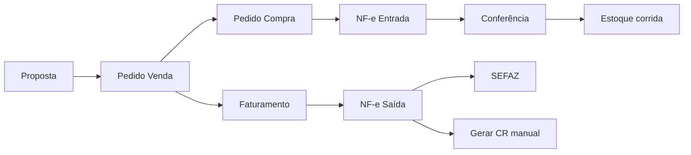

# Especificação do Nexus ERP

Documento de referência técnica e funcional do sistema. Complementa o [roadmap](roadmap-nexus-erp.md) (evolução e fases) com a **fotografia atual** da aplicação.

> **Última atualização:** 24/06/2026 — ERP 4.0.15.2.40  
> **Repositório:** `nexus-valve-hub`  
> **Público-alvo:** desenvolvedores, analistas, operação e gestão de produto

---

## Sumário

1. [Visão geral](#1-visão-geral)
2. [Arquitetura técnica](#2-arquitetura-técnica)
3. [Infraestrutura e execução](#3-infraestrutura-e-execução)
4. [Autenticação, permissões e contexto](#4-autenticação-permissões-e-contexto)
5. [Modelo operacional](#5-modelo-operacional)
6. [Módulos funcionais](#6-módulos-funcionais)
7. [API REST — visão geral](#7-api-rest--visão-geral)
8. [Frontend — estrutura e rotas](#8-frontend--estrutura-e-rotas)
9. [Fluxos de negócio principais](#9-fluxos-de-negócio-principais)
10. [Integrações externas](#10-integrações-externas)
11. [Design system e UX](#11-design-system-e-ux)
12. [Regras transversais e limitações atuais](#12-regras-transversais-e-limitações-atuais)
13. [Documentação complementar](#13-documentação-complementar)

---

## 1. Visão geral

### 1.1 O que é

O **Nexus ERP** é um sistema de gestão empresarial voltado à operação industrial/comercial de distribuição de válvulas e materiais correlatos. Cobre o ciclo desde **cadastro de produtos técnicos** até **comercial, fiscal (NF-e/CT-e), estoque por corrida, qualidade (certificados) e financeiro**.

### 1.2 Princípios de produto

| Princípio | Descrição |
|-----------|-----------|
| **Evolução incremental** | Funcionalidades entregues em fases numeradas (ERP 4.0.x), com homologação antes de ligar comportamentos globais |
| **Separação fiscal entrada × saída** | Entrada valida XML recebido; saída usa cenário fiscal para proposta/emissão |
| **Estoque não bloqueia NF-e** | Venda sob demanda; atendimento flexível (entrada antes ou depois da saída) |
| **Financeiro manual na origem fiscal** | Geração de CR/CP a partir de NF-e exige ação explícita do usuário |
| **Rastreabilidade industrial** | Corrida/lote, certificado de fornecedor (CF) e certificado de qualidade (CQ) |
| **Somente leitura onde aplicável** | Painéis consolidados (BI, centro de informações do produto) não alteram regras de negócio |

### 1.3 Macrofrentes

| # | Frente | Status atual |
|---|--------|----------------|
| 1 | Cadastros mestres | Parcial — produto com abas + painel operacional |
| 2 | CRM | Não iniciado |
| 3 | Propostas | Em evolução — homologação fiscal, conversão PV |
| 4 | Pedido de venda | Parcial — faturamento parcial, NF-e rascunho/homologação/produção |
| 5 | Fiscal NF-e/CT-e | Avançado — entrada, saída, DFe, manifestação, apuração |
| 6 | Estoque / rastreabilidade | Parcial — saldo por corrida, atendimento, painel produto |
| 7 | Qualidade | Parcial — CF, CQ, numeração automática |
| 8 | Financeiro | Base operacional — CR/CP, créditos, relatórios |
| 9 | Contábil | Placeholder |
| 10 | BI / relatórios | Parcial — dashboards por módulo, relatórios financeiros PDF |

---

## 2. Arquitetura técnica

### 2.1 Visão em camadas

```text
┌─────────────────────────────────────────────────────────────┐
│  Frontend SPA (React + Vite + TypeScript)                   │
│  Porta host: 5174 (Docker) — proxy /api → backend           │
└──────────────────────────┬──────────────────────────────────┘
                           │ HTTPS / JSON (JWT Bearer)
┌──────────────────────────▼──────────────────────────────────┐
│  Backend API (Django 5.2 + Django REST Framework)             │
│  Porta: 8000 — prefixo /api/                                │
├─────────────────────────────────────────────────────────────┤
│  Apps de domínio: cadastros, produtos, comercial, fiscal,   │
│  qualidade, financeiro, regras_fiscais, expedicao, core…      │
└──────────────────────────┬──────────────────────────────────┘
                           │
┌──────────────────────────▼──────────────────────────────────┐
│  PostgreSQL 15                                              │
└─────────────────────────────────────────────────────────────┘
                           │
┌──────────────────────────▼──────────────────────────────────┐
│  Integrações: SEFAZ (PyNFe), ViaCEP, consulta CNPJ/IE         │
└─────────────────────────────────────────────────────────────┘
```

### 2.2 Backend — apps Django

| App | Caminho | Responsabilidade |
|-----|---------|------------------|
| `cadastros` | `backend/apps/cadastros/` | Empresa, cliente, fornecedor, transportadora, colaborador |
| `produtos` | `backend/apps/produtos/` | Catálogo, famílias, NCM, dimensões, equivalência/composição, painel operacional |
| `corridas` | `backend/apps/corridas/` | Corrida/lote técnico (rastreabilidade) |
| `regras_fiscais` | `backend/apps/regras_fiscais/` | Regras e cenários fiscais entrada/saída |
| `comercial` | `backend/apps/comercial/` | Propostas, pedidos venda/compra, faturamento |
| `fiscal` | `backend/apps/fiscal/` | NF-e, CT-e, estoque, conferência, SEFAZ, DFe, manifestação |
| `qualidade` | `backend/apps/qualidade/` | Certificados CQ/CF, PDF, numeração |
| `financeiro` | `backend/apps/financeiro/` | CR/CP, parcelas, baixas, créditos, relatórios |
| `contabil` | `backend/apps/contabil/` | Plano de contas, lançamentos (básico) |
| `expedicao` | `backend/apps/expedicao/` | Expedição/logística (fase 1A) |
| `apuracao_fiscal` | `backend/apps/apuracao_fiscal/` | API de apuração (delega ao fiscal) |
| `relatorios` | `backend/apps/relatorios/` | Motor PDF genérico (não fiscal) |
| `core` | `backend/apps/core/` | Contexto app, busca global, minha conta, numeração |

**Migrations (schema):** ~163 migrations nos apps customizados; maior volume em `fiscal` (56) e `comercial` (36).

### 2.3 Frontend — stack

| Tecnologia | Uso |
|------------|-----|
| React 18 | UI |
| Vite 5 | Build e dev server |
| TypeScript | Tipagem |
| react-router-dom v6 | Rotas aninhadas |
| Axios | HTTP + interceptors JWT |
| Tailwind CSS 3 | Estilos |
| shadcn/ui (Radix) | Primitivos de interface |
| Nexus Design System | Componentes compostos (`components/nexus/`) |
| react-hook-form + zod | Formulários |
| recharts | Gráficos BI |
| sonner | Toasts |
| Vitest + Playwright | Testes |

**Estado:** hooks locais + caches manuais (`usePaginatedList`, `useAppContexto`). TanStack Query está no `package.json` mas não é usado atualmente.

### 2.4 Estrutura de pastas (resumo)

```text
nexus-valve-hub/
├── backend/
│   ├── nexus_erp/          # settings, urls raiz, dashboard BI
│   └── apps/               # domínios Django
├── frontend/
│   └── src/
│       ├── pages/          # telas por rota
│       ├── components/     # UI por domínio + nexus + ui
│       ├── services/api/   # clientes HTTP por módulo
│       ├── hooks/          # data fetching reutilizável
│       ├── lib/            # helpers de negócio/formatadores
│       └── types/          # interfaces TypeScript compartilhadas
├── docs/                   # documentação viva
└── docker-compose.yml
```

---

## 3. Infraestrutura e execução

### 3.1 Docker Compose

| Serviço | Imagem / build | Porta host | Função |
|---------|----------------|------------|--------|
| `db` | postgres:15 | interna | Banco `nexus_erp` |
| `backend` | `./backend` | 8000 | API Django (`runserver --noreload`) |
| `frontend` | `./frontend` | 5174 | Vite; `VITE_API_URL=/api` com proxy para backend |

**Comandos típicos:**

```bash
docker compose up -d
docker compose restart backend    # após alterar rotas/views
docker compose exec backend python manage.py test apps.<app> -v 1
docker compose exec frontend npm run build
```

### 3.2 Variáveis de ambiente

Arquivo `.env` na raiz (não versionado). Principais grupos:

- **Banco:** `DB_NAME`, `DB_USER`, `DB_PASSWORD`
- **Django:** `SECRET_KEY`, `DEBUG`
- **Portas:** `BACKEND_PORT`, `FRONTEND_PORT`
- **Fiscal:** `NFE_PRODUCAO_HABILITADA`, certificados A1, `NO_PROXY` para SEFAZ
- **Frontend:** `VITE_API_URL`, `VITE_PROXY_TARGET`

### 3.3 Locale e convenções

- Idioma UI: **pt-BR**
- Fuso: `America/Sao_Paulo`
- Moeda: BRL (formatação em `lib/formatBr.ts`, `numberFormat.ts`)
- Datas exibidas: `dd/mm/aaaa` (`lib/dateBr.ts`)

---

## 4. Autenticação, permissões e contexto

### 4.1 Autenticação JWT

| Endpoint | Método | Descrição |
|----------|--------|-----------|
| `/api/token/` | POST | Login — retorna `access` + `refresh` |
| `/api/token/refresh/` | POST | Renova access token |

- Access token: ~8h; refresh: ~7 dias
- Frontend persiste em `localStorage`; interceptor Axios adiciona `Authorization: Bearer`
- 401 → limpa sessão e redireciona para `/login`

### 4.2 Permissões

**Padrão global DRF:** `IsAuthenticated` em todas as views, salvo exceções.

**Grupos Django** (`create_groups`):

`admin`, `administrador`, `operador`, `comercial`, `compras`, `financeiro`, `estoque`, `produtos`, `consulta`, `qualidade`, `fiscal`

**Qualidade:** permissões granulares por model (`view_certificadoqualidade`, etc.).

**Dashboard BI:** `dashboard_permissions.py` — cada módulo (`comercial`, `fiscal`, `estoque`, `compras`, `qualidade`, `financeiro`) exige combinação de `has_perm`; admin/superuser vê tudo.

### 4.3 Contexto da aplicação

| Endpoint | Conteúdo |
|----------|----------|
| `GET /api/app/contexto/` | Usuário (`nome_exibicao`), empresa atual, ambiente (homologação/produção) |
| `GET /api/minha-conta/` | Dados da conta logada |
| `PATCH /api/minha-conta/` | E-mail, telefone |
| `POST /api/minha-conta/alterar-senha/` | Troca de senha |
| `GET /api/busca-global/?q=` | Busca unificada (cadastros, documentos, financeiro) |
| `GET /api/dashboard/permissoes/` | Módulos BI visíveis ao usuário |

**Colaborador ↔ usuário:** FK opcional em `Colaborador.usuario`; gestão de acesso na tela Colaboradores (`PATCH .../acesso/`).

---

## 5. Modelo operacional

Documento completo: [`modelo-operacional-nexus.md`](modelo-operacional-nexus.md).

### 5.1 Premissa

A operação Nexus é **venda sob demanda** com atendimento flexível. O ERP controla **origem e intenção de atendimento** do item, não apenas saldo físico.

### 5.2 Fluxos A / B / C

| Fluxo | Sequência resumida |
|-------|-------------------|
| **A — Entrada antes da saída** | PV → PC → NF entrada → conferência → faturamento → NF saída |
| **B — Saída antes da entrada** | PV → faturamento → NF saída → retirada fornecedor → NF entrada posterior |
| **C — Misto** | Parte conciliada + parte pendente por item/quantidade |

**Regra:** NF-e saída **não é bloqueada** automaticamente por ausência de NF-e entrada.

### 5.3 Entidades operacionais-chave

| Modelo | Papel |
|--------|-------|
| `AlocacaoAtendimento` | Intenção de atendimento por item (tipo, origem/destino físico, vínculos PC/NF/CT-e) |
| `AtendimentoEstoque` | Compromisso de estoque na NF saída (sem baixa física automática) |
| `EstoqueCorrida` | Saldo físico por produto × corrida |
| `FaturamentoPedidoVenda` | Solicitação de faturamento parcial/total → NF-e saída |

### 5.4 Classificação DF-e

| Classe | Uso |
|--------|-----|
| Operacional | Documentos do dia a dia (emissão própria, conferência) |
| Base importada | XML histórico para consulta/conferência (fora da apuração automática como operacional) |
| Homologação | Testes SEFAZ — excluída de apuração e fechamentos reais |

---

## 6. Módulos funcionais

### 6.1 Cadastros

**Telas:** Empresas, Clientes, Fornecedores, Transportadoras, Colaboradores, Minha conta

**Modelos:** `Empresa`, `Cliente`, `Fornecedor`, `Transportadora`, `Colaborador`

**Recursos:**

- Consulta CEP/CNPJ/IE integrada
- Colaborador com funções internas (vendedor, comprador, fiscal…) e vínculo a usuário Django
- Gestão de perfil de acesso e senha inicial
- Empresa com certificado A1 para NF-e/SEFAZ

**API (router):** `empresas`, `clientes`, `fornecedores`, `transportadoras`, `colaboradores`, `usuarios`

---

### 6.2 Produtos

**Tela:** `/produtos` — modal de cadastro com abas:

| Aba | Conteúdo |
|-----|----------|
| Dados gerais | Código, descrição, unidade comercial, preços, estoque mínimo |
| Classificação industrial | Material, norma, família, dimensional (polegada, rosca, schedule), conversões |
| Composição / montagem | BOM, equivalência fornecedor, processos |
| Fiscal | NCM efetivo, unidade fiscal |
| Painel operacional | Centro de informações (somente leitura) |
| Rastreabilidade | Placeholder — fase futura |

**Modelos principais:** `Produto`, `FamiliaProduto`, `Ncm`, `Polegada`, `RoscaConexao`, `ScheduleEspessura`, `ProdutoComposicao`, `FornecedorProdutoEquivalencia`

**Painel operacional** (`GET /api/produtos/{id}/painel/resumo/`):

| Seção | Dados |
|-------|-------|
| Resumo | Saldo físico, reservado, disponível; última compra/venda/NF/CQ/corrida |
| Compras | Histórico (10) + inteligência de preços |
| Vendas | Histórico (10) + inteligência de preços |
| Qualidade | CQs e corridas (10 cada) |
| Fiscal | NF-e entrada e saída (10 cada) |

Serviço: `backend/apps/produtos/painel_operacional.py` — **somente leitura**, sem migrations.

**API:** `produtos`, `familias-produto`, `ncms`, `polegadas`, `roscas-conexao`, `schedules-espessura`, `produto-composicoes`, `fornecedor-produto-equivalencias`

---

### 6.3 Comercial — Propostas

**Tela:** `/propostas`

**Fluxo:** CRUD proposta → itens (produto cadastrado ou avulso com NCM) → precificação → opt-in cenário fiscal → homologação assistida → conversão em pedido de venda

**Modelos:** `Proposta`, `ItemProposta`, `HomologacaoFiscalPropostaEvento`, `PropostaComercialHistorico`

**Numeração:** `PROP-AAAAMMDD-NNNN`

**PDF:** `GET /api/propostas/{id}/pdf/` (versão externa, sem rentabilidade interna)

---

### 6.4 Comercial — Pedido de venda

**Tela:** `/pedidos-venda` — modal em abas (Resumo, Itens, Faturamento, NF-e/Fiscal, Observações)

**Modelos:** `PedidoVenda`, `ItemPedidoVenda`, `FaturamentoPedidoVenda`, `ItemFaturamentoPedidoVenda`

**Numeração:** `PV-AAAAMMDD-NNNN`; faturamento `FAT-YYYYMMDD-NNNN`

**Capacidades:**

- Conversão a partir de proposta (`converter_proposta_pedido`)
- Faturamento parcial com `quantidade_faturada` / `status_item`
- Geração NF-e rascunho a partir de faturamento `PRONTO_PARA_NFE`
- PDF comercial: `GET /api/pedidos-venda/{id}/pdf/`
- Resumo atendimento operacional e alocações por item

**API:** `pedidos-venda`, `vendedores`, `propostas`

---

### 6.5 Compras — Pedido de compra

**Tela:** `/pedidos-compra`

**Modelos:** `PedidoCompra`, `ItemPedidoCompra` (com `quantidade_recebida`)

**Numeração:** `PC-AAAAMMDD-NNNN`

**PDF:** `GET /api/pedidos-compra/{id}/pdf/`

**Vínculos:** NF-e entrada pode referenciar pedido de compra; conferência aplica estoque

---

### 6.6 Fiscal — NF-e entrada

**Telas:**

- `/nfe-entrada` — operacional (emitir entrada própria, importar XML fornecedor)
- `/nfe-entrada-historica-importada` — base importada
- `/nfe-entrada/:id/conferencia` — conferência item a item

**Modelos:** `NFeEntrada`, `ItemNFeEntrada`, `NFeEntradaConferencia`, `ItemNFeEntradaConferencia`, `NFeEntradaHistoricaImportada`

**Fluxo conferência:**

1. Importar XML (fornecedor ou entrada própria já emitida)
2. Conferir itens (produto, quantidade, equivalência sugerida)
3. Aplicar estoque físico por corrida (quando finalizado)
4. Gerar CP manualmente (wizard financeiro 4.0.14.4)

**Identificação de fornecedor:** auto-vínculo e ações na UI (`fornecedor_entrada.py`) para liberar CP.

---

### 6.7 Fiscal — NF-e saída

**Tela:** `/nfe-saida` — listagem compacta + drawer de detalhe/conferência

**Modelos:** `NFeSaida`, `ItemNFeSaida`, `NFeSaidaEvento`, `NFeNumeracaoConfiguracao`

**Ciclo de vida (resumido):**

```text
RASCUNHO → conferência (abas) → prontidão → XML prévia/oficial
  → homologação SEFAZ (tpAmb=2) → [produção SEFAZ se habilitada]
```

**Recursos principais:**

- Validação pré-emissão (`validar-emissao`, checklist homologação)
- Preview XML (nfelib 4.00) e DANFE (BrazilFiscalReport — renderer oficial)
- Atualizar impostos do rascunho a partir da regra fiscal atual
- Reforma tributária IBS/CBS no snapshot e XML
- Duplicatas `<cobr>/<dup>` no XML
- Emissão homologação: assinatura A1, transmissão PyNFe, DANFE BFR
- Emissão produção: backend pronto, flag `NFE_PRODUCAO_HABILITADA` (controle operacional)
- DIFAL para venda interestadual a não contribuinte
- Pool de numeração com reutilização de número não transmitido
- Envio e-mail DANFE/XML (`NFeSaidaEnvioEmail`)

**API:** `nf-saidas`, `nfe-numeracoes`, `nfe-sefaz-status`

---

### 6.8 Fiscal — CT-e, DFe e manifestação

| Tela | Função |
|------|--------|
| `/cte-entrada` | CT-e operacional |
| `/cte-historico-importado` | Base CT-e importada + conferência |
| `/central-dfe` | Central DF-e — armazenamento e consulta XML |
| `/manifestacao-destinatario` | Manifestação do destinatário (Ciência, Confirmação, etc.) |
| `/nfe-historica-importada` | Base NF-e saída importada |
| `/visao-gerencial-nfe-historica` | Painel fiscal gerencial histórico |
| `/apuracao-fiscal` | Apuração entrada/saída |
| `/regras-fiscais` | Regras legadas + cenários entrada/saída |
| `/nfe-sefaz` | Status do serviço SEFAZ |

**Manifestação:** consulta manual DF-e, manifestação auditável, download XML → base importada (sem financeiro/estoque automático).

---

### 6.9 Regras fiscais

**Cenário de saída:** `CenarioFiscalSaida` + escopos (Geral, NCM, prefixo NCM, Produto) + `RegraFiscalSaida` com prioridade e UFs.

**Cenário de entrada:** `CenarioFiscalEntrada` + `RegraFiscalEntrada` + CFOP origem × CFOP entrada.

**Motor:** fallback para `RegraFiscal` legada; comparativo legado × cenário; homologação por proposta.

**Checklist produção:** `GET /api/regras-fiscais/checklist-producao/`

---

### 6.10 Estoque e atendimento

**Telas:**

| Rota | Função |
|------|--------|
| `/estoque` | Saldos consolidados e por corrida |
| `/atendimentos-estoque` | Atendimentos operacionais (`AlocacaoAtendimento`) |
| `/expedicao` | Expedição/logística (fase 1A) |

**Modelos:** `EstoqueCorrida`, `AtendimentoEstoque`, `AtendimentoEstoqueLinha`, `AlocacaoAtendimento`

**Saldo consolidado** (`montar_saldo_consolidado_produto`):

- `saldo_fisico` = soma `EstoqueCorrida.saldo`
- `reservado` = quantidade pendente em atendimentos PENDENTE/PARCIAL
- `disponivel` = físico − reservado

**API:** `estoque`, `estoque/saldos`, `estoque/saldos-consolidados`, `atendimentos-estoque`, `atendimentos-operacionais`, `alocacoes-atendimento`

---

### 6.11 Qualidade

**Telas:** `/certificados`, `/certificados-fornecedor`, `/corridas`

**Modelos:**

- `CertificadoQualidade` + itens (CQ emitido ao cliente)
- `CertificadoFornecedorEntrada` + itens (CF na entrada)
- `Corrida` — lote técnico com ensaios JSON
- `SequenciaCertificadoQualidade` — numeração automática

**Regras:** emissão definitiva de CQ exige rastreabilidade; CQ manual permitido sem CF em cenários específicos.

**API:** `certificados`, `certificados-qualidade`, `certificados-fornecedor`, `corridas`

---

### 6.12 Financeiro

**Telas:**

| Rota | Função |
|------|--------|
| `/financeiro` | Visão geral, alertas, KPIs |
| `/financeiro/contas-receber` | Títulos a receber |
| `/financeiro/contas-pagar` | Títulos a pagar (fornecedor, despesa, tributo) |
| `/financeiro/creditos` | Créditos cliente/fornecedor |
| `/financeiro/cadastros` | Contas, categorias, centros de custo |
| `/financeiro/relatorios/*` | Relatórios JSON + PDF |

**Modelos:** `TituloFinanceiro`, `ParcelaFinanceira`, `BaixaFinanceira`, `CreditoFinanceiro`, `ContaFinanceira`, `CategoriaFinanceira`, `CentroCusto`

**Origens de título:**

| Origem | Geração |
|--------|---------|
| Manual | CR/CP, despesa, tributo |
| NF-e saída autorizada | Wizard manual `gerar-contas-receber` |
| NF-e entrada conferida | Wizard manual `gerar-contas-pagar` |
| Crédito | Pagamento a maior, devolução, outros |

**Numeração:** `CR-AAAA-NNNNNN` / `CP-AAAA-NNNNNN`

**Formas de pagamento:** lista fixa (sem cadastro de condições).

**API:** `financeiro/contas-receber`, `financeiro/contas-pagar`, `financeiro/baixas`, `financeiro/creditos`, `financeiro/resumo`, `financeiro/relatorios/*`

---

### 6.13 Contábil

**Tela:** `/contabil` — placeholder

**Modelos:** `PlanoConta`, `Lancamento` — estrutura básica, integração futura.

---

### 6.14 BI e dashboards

**Telas:** `/dashboard` + `/dashboard/{comercial|fiscal|estoque|compras|qualidade|financeiro}`

**API:** `GET /api/dashboard/home/`, `.../comercial/`, etc.; `GET /api/dashboard/resumo/` (legado)

**Conteúdo:** KPIs, gráficos Recharts, alertas, drill-down com filtros de período; financeiro em estado de preparação onde aplicável.

---

## 7. API REST — visão geral

### 7.1 Convenções

| Aspecto | Padrão |
|---------|--------|
| Base URL | `/api/` |
| Formato | JSON |
| Autenticação | `Authorization: Bearer <access>` |
| Paginação | `NexusPageNumberPagination` — `?page=`, `?page_size=`, `?search=`, `?ordering=` |
| Autocomplete | `?limit=N` sem `page` → array direto (`AutocompleteOrPaginationMixin`) |
| Erros | DRF padrão + mensagens amigáveis em validações de negócio |
| IDs | Inteiros; decimais monetários como string ou number conforme serializer |

### 7.2 Router principal

Arquivo: `backend/apps/api_urls.py` — ~50 ViewSets registrados + rotas explícitas para PDF, dashboard, financeiro, manifestação, conferência.

### 7.3 Endpoints especiais (não-CRUD)

| Grupo | Exemplos |
|-------|----------|
| Auth | `token/`, `token/refresh/` |
| Consultas | `consulta-cep/`, `consulta-cnpj/`, `consulta-ie/` |
| PDF comercial | `propostas/{id}/pdf/`, `pedidos-venda/{id}/pdf/`, `pedidos-compra/{id}/pdf/` |
| NF-e saída | `nf-saidas/{id}/conferencia/`, `preview-xml/`, `preview-danfe/`, `emitir-homologacao/`, `emitir-producao/` |
| NF-e entrada | `nf-entradas/importar-entrada-propria-emitida/`, conferência actions |
| Financeiro | `financeiro/resumo/`, `nf-saidas/{id}/gerar-contas-receber/`, relatórios PDF |
| Produto | `produtos/{id}/painel/resumo/` |
| Core | `app/contexto/`, `busca-global/`, `minha-conta/` |

### 7.4 Documentação de contratos

Tipos TypeScript espelham a API em `frontend/src/types/index.ts`.  
Serviços HTTP em `frontend/src/services/api/*.ts`.

---

## 8. Frontend — estrutura e rotas

### 8.1 Shell da aplicação

```text
Login (/login)
  └── PrivateRoute
        └── MainLayout (Sidebar + Header + Outlet)
              └── Páginas de domínio
```

- **Sidebar:** menu por área (Cadastros, Produtos, Compras, Comercial, Fiscal, Estoque, Qualidade, Financeiro, Contábil)
- **Header:** busca global, empresa atual, menu usuário, selo homologação
- **Breadcrumbs:** `MainLayout` + `lib/sidebarNav.ts`

### 8.2 Rotas protegidas (completas)

| Área | Rotas |
|------|-------|
| Dashboard | `/dashboard`, `/dashboard/comercial`, `.../fiscal`, `.../estoque`, `.../compras`, `.../qualidade`, `.../financeiro` |
| Cadastros | `/empresas`, `/clientes`, `/clientes/novo`, `/clientes/:id/edit`, `/fornecedores/*`, `/transportadoras/*`, `/colaboradores` |
| Conta | `/minha-conta`, `/minha-conta/alterar-senha` |
| Produtos | `/produtos` |
| Comercial | `/propostas`, `/pedidos-venda` |
| Compras | `/pedidos-compra`, `/nfe-entrada`, `/nfe-entrada-historica-importada`, `/nfe-entrada/:id/conferencia` |
| Fiscal | `/nfe-saida`, `/nfe-sefaz`, `/nfe-historica-importada`, `/central-dfe`, `/manifestacao-destinatario`, `/visao-gerencial-nfe-historica`, `/cte-entrada`, `/cte-historico-importado`, `/regras-fiscais`, `/apuracao-fiscal` |
| Estoque | `/estoque`, `/atendimentos-estoque`, `/expedicao` |
| Qualidade | `/certificados`, `/certificados-fornecedor`, `/corridas` |
| Financeiro | `/financeiro`, `/financeiro/contas-receber`, `.../contas-pagar`, `.../creditos`, `.../cadastros`, `.../relatorios` (+ 6 sub-relatórios) |
| Contábil | `/contabil` |

### 8.3 Padrões de UI

| Padrão | Componentes |
|--------|-------------|
| Listagem paginada | `usePaginatedList` + `DataTableShell` + `PaginationControls` + `FilterBar` |
| Estados async | `TableSkeleton`, `EmptyState`, `ErrorState`, `LoadingSpinner` |
| Status | `StatusBadge` com tokens em `design-system/tokens.ts` |
| Formulários cadastro | `CadastroFormShell`, `CadastroTabs`, `AsyncAutocomplete` |
| Modais comerciais | `PedidoVendaEditModal`, drawers NF-e |
| Mensagens operacionais | `OperationalMessage`, `operationalUi.ts` (linguagem de negócio vs técnico) |

---

## 9. Fluxos de negócio principais

### 9.1 Venda completa (happy path A)



### 9.2 Venda antecipada (fluxo B)


### 9.3 Conferência NF-e entrada

1. Importar XML → status pendente conferência
2. Mapear itens → produto (cadastrado ou equivalência sugerida)
3. Resolver pendências (produto, estoque, pedido)
4. Finalizar → aplica estoque por corrida (se elegível)
5. Opcional: gerar CP via wizard financeiro

### 9.4 Emissão NF-e saída

1. Faturamento `PRONTO_PARA_NFE` → gerar rascunho NF-e
2. Conferência por abas (itens, fiscal, reforma, transporte)
3. Validar / marcar pronta
4. Preview XML + DANFE
5. Checklist homologação (opcional)
6. Emitir homologação ou produção (conforme ambiente e flag)
7. Opcional: gerar CR via wizard

### 9.5 Centro de informações do produto

1. Abrir produto salvo → aba Painel Operacional
2. `GET /api/produtos/{id}/painel/resumo/` sob demanda
3. Navegar sub-abas: Resumo, Compras, Vendas, Qualidade, Fiscal
4. Links para documentos de origem (PV, NF saída, conferência)

---

## 10. Integrações externas

| Integração | Biblioteca / serviço | Uso |
|------------|---------------------|-----|
| SEFAZ NF-e | PyNFe, nfelib | Emissão, consulta status, manifestação, cancelamento |
| DANFE PDF | BrazilFiscalReport 0.7.4 | Renderer oficial (`DANFE_RENDERER_OFICIAL=BFR`) |
| Certificado A1 | cryptography, signxml | Assinatura XML |
| CEP | ViaCEP (API) | Cadastro endereços |
| CNPJ | API consulta | Cadastro fornecedor/cliente |
| IE | SEFAZ por UF | Validação inscrição estadual |
| E-mail | SMTP configurável | Envio DANFE/XML NF-e saída |

**Proxy SEFAZ:** `NO_PROXY` configurado no Docker para domínios `.fazenda.gov.br`, `.sefaz.*`.

---

## 11. Design system e UX

Documento: [`design-system-nexus.md`](design-system-nexus.md)

### 11.1 Tokens

Definidos em `frontend/src/index.css` (CSS variables) e `frontend/src/design-system/tokens.ts`:

- Cores semânticas (primary, success, warning, destructive)
- Status por domínio (fiscal, estoque, qualidade, comercial, financeiro)
- Sidebar, sombras, raios

### 11.2 Componentes Nexus

Pacote `frontend/src/components/nexus/`:

`PageContainer`, `NexusCard`, `StatusBadge`, `DataTable`, `DataTableShell`, inputs de domínio (`CurrencyInput`, `SearchInput`), `EmptyState`, `ErrorState`, `OperationalMessage`, `AdvancedSupportSection`

### 11.3 Princípio operacional de UI (4.0.13.8)

- Linguagem de negócio na tela principal
- Detalhes técnicos (XML múltiplos, renderer, IDs internos) em seção Avançado/Suporte
- Status e ações padronizados (`operationalUi.ts`)

---

## 12. Regras transversais e limitações atuais

### 12.1 O que o sistema NÃO faz automaticamente (por design)

| Comportamento | Situação |
|---------------|----------|
| Gerar CR ao autorizar NF-e saída | Manual — wizard 4.0.14.3 |
| Gerar CP ao conferir NF-e entrada | Manual — wizard 4.0.14.4 |
| Baixar estoque ao emitir NF-e saída | Não — aplicação física na conferência entrada |
| Bloquear NF-e saída sem entrada | Não — modelo operacional flexível |
| Aplicar cenário fiscal na transmissão | Parcial — recálculo em rascunho; consumo pleno na emissão é evolução |
| Multiempresa / troca de CNPJ na sessão | Não — ERP 4.1 futuro |
| CRM / pipeline comercial | Não iniciado |
| Kardex / MovimentoEstoque | Não |
| Conciliação bancária | Não |
| SPED / contabilidade automática | Futuro |

### 12.2 Ambientes fiscais

| Ambiente | `tpAmb` | Uso |
|----------|---------|-----|
| Homologação | 2 | Testes SEFAZ, excluído de apuração real |
| Produção | 1 | Operação real — flag `NFE_PRODUCAO_HABILITADA` |

### 12.3 Testes e qualidade de código

- Backend: `python manage.py test apps.<app>` — runner isolado `NexusDiscoverRunner` (DB `test_*`)
- Frontend: `npm run test` (Vitest), testes de componentes por fase (`*401*.test.tsx`)
- Build: `npm run build` obrigatório antes de deploy frontend

### 12.4 Comandos de manutenção

| Comando | Função |
|---------|--------|
| `create_groups` | Cria grupos de permissão |
| `criar_usuario_inicial` | Usuário admin inicial |
| `gerar_relatorio_pre_producao` | Checklist pré-produção JSON |
| `limpar_dados_teste_nexus` | Limpeza ambiente teste (dry-run) |
| `verificar_prontidao_producao` | Validação go-live |

---

## 13. Documentação complementar

| Documento | Conteúdo |
|-----------|----------|
| [roadmap-nexus-erp.md](roadmap-nexus-erp.md) | Evolução por fases, checklists, prioridades |
| [modelo-operacional-nexus.md](modelo-operacional-nexus.md) | Fluxos A/B/C, alocação, estoque |
| [design-system-nexus.md](design-system-nexus.md) | Tokens e componentes UI |
| [base-dfe-importada.md](base-dfe-importada.md) | Classificação DF-e importado |
| [go-live-nfe-saida-producao.md](go-live-nfe-saida-producao.md) | Runbook NF-e produção |
| [deploy-erp-40152-manifestacao-dfe-producao.md](deploy-erp-40152-manifestacao-dfe-producao.md) | Deploy produção fiscal |
| [reforma-tributaria-nfe-nexus.md](reforma-tributaria-nfe-nexus.md) | IBS/CBS, flags, preparação |
| [qualidade-certificados.md](qualidade-certificados.md) | CF, CQ, rastreabilidade |
| [comercial-numeracao.md](comercial-numeracao.md) | PROP/PV/PC/FAT |
| [nfe-saida-envio-email-danfe-xml.md](nfe-saida-envio-email-danfe-xml.md) | E-mail pós-emissão |
| [expedicao-logistica-fase1a.md](expedicao-logistica-fase1a.md) | Módulo expedição |
| `backend/docs/importacao_ncm.md` | Importação tabela NCM |

---

## Histórico deste documento

| Data | Versão ERP | Alteração |
|------|------------|-----------|
| 24/06/2026 | 4.0.15.2.40 | Criação da especificação completa |

---

*Este documento descreve o estado do sistema na branch `producao-local` em 24/06/2026. Para mudanças planejadas, consulte o [roadmap](roadmap-nexus-erp.md).*
